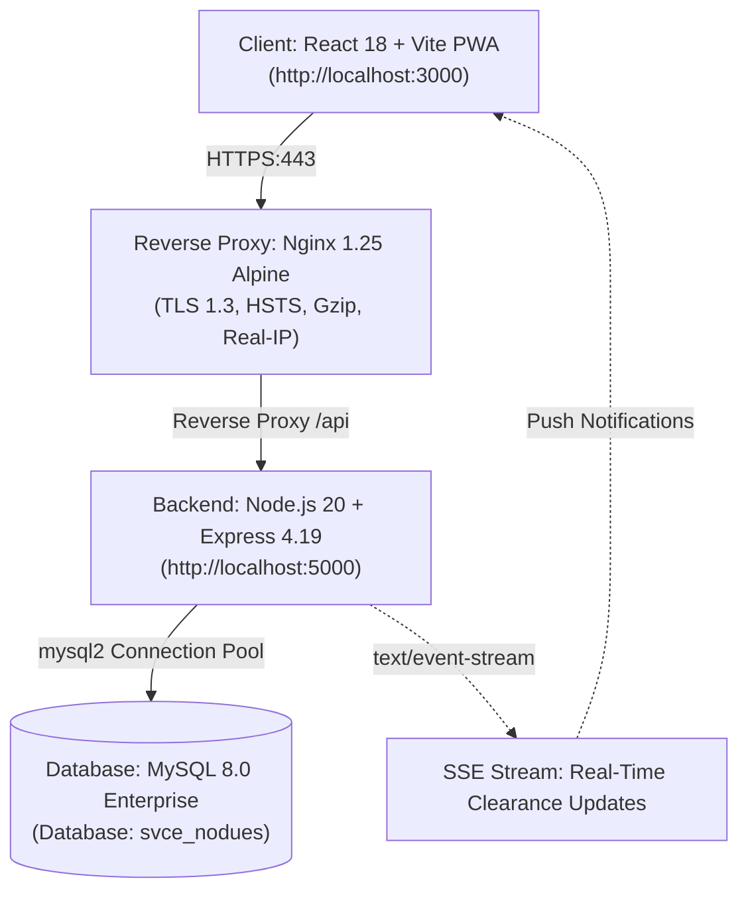
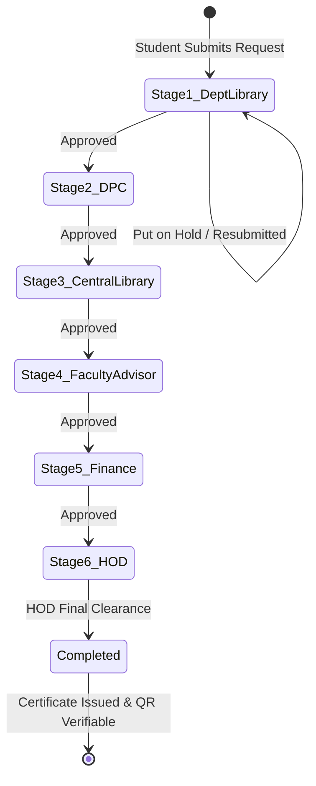

# Sri Venkateswara College of Engineering
### Department of Information Technology
## SVCE Smart No-Dues & Institutional Clearance ERP System
### Comprehensive Technical, Administrative & Operational Reference Manual

---

## 1. Executive Summary & Institutional Scope

The **SVCE Smart No-Dues ERP** is an automated, web-based institutional clearance platform engineered for Sri Venkateswara College of Engineering (Autonomous Institution, Affiliated to Anna University, Chennai). The platform transforms historical paper-based clearance circulars into a transparent, auditable digital workflow.

> [!IMPORTANT]
> **Essential Institutional Distinction:**  
> The **No-Dues Clearance Certificate** issued by this system is an **institutional clearance document** certifying that a student has settled all departmental library books, lab equipments, tuition fees, placement records, and institutional dues. This clearance is required for the release of semester examination hall tickets, course completion certificates, and transfer certificates.  
> It is **strictly distinct from the official Degree Certificate**, which is awarded exclusively by **Anna University, Chennai**, upon successful completion of the academic degree programme.

Historically, students completed physical clearance forms by manually visiting multiple departments, libraries, laboratories, and the central administrative accounts section. The Smart No-Dues ERP streamlines this workflow through an automated 6-stage sequential state machine. Processing turnaround times, hold frequency, and administrative efficiency will be measured and benchmarked empirically during the semester-end pilot.

---

## 2. System Architecture & Technology Stack

The platform is designed around a three-tier architecture providing separation of presentation, business logic, and persistent storage:



### Technical Component Specifications
- **Frontend Layer:** React 18 with Vite PWA, Tailwind CSS, Lucide icons, Chart.js, HTML5 Canvas QR rendering. Accessible via `http://localhost:3000` during local execution and standard HTTPS on production domains.
- **Backend Application Layer:** Node.js 20 LTS running Express.js 4.19. Features Pino structured logging with request correlation IDs, Helmet HTTP security headers, and connection pooling via `mysql2/promise`.
- **Database Engine:** MySQL 8.0 with InnoDB engine, enforcing strict referential integrity, foreign key cascades, unique active slot constraints, and transaction isolation (`READ COMMITTED`).
- **Real-Time Notification Pipeline:** Unbuffered Server-Sent Events (SSE) broadcasting live stage progression, fine settlements, and hall ticket releases.

---

## 3. Cryptographic Integrity & Anti-Tamper Architecture

To preserve the authenticity of issued certificates and prevent retroactive manipulation of clearance decisions, the system implements dual-layer cryptographic controls:

### 3.1 Digital Certificate HMAC-SHA256 Signing
Upon final clearance approval by the Head of Department (Stage 6), the system automatically mints a unique digital clearance certificate. The certificate's authenticity is verified via an HMAC-SHA256 signature calculated over an immutable canonical tuple:

$$\text{Payload} = \text{certificate\_number} \parallel \text{register\_number} \parallel \text{issue\_date} \parallel \text{request\_id}$$

$$\text{Signature} = \text{HMAC-SHA256}(\text{CERT\_HMAC\_KEY}, \text{Payload})$$

- **Signing Key:** Isolated 256-bit server secret (`CERT_HMAC_KEY`).
- **Timing-Safe Verification:** Signature validation executes via `crypto.timingSafeEqual` over raw byte buffers to protect against timing analysis side channels.
- **Verification URL Entropy:** Public verification tokens are generated using a Cryptographically Secure Pseudo-Random Number Generator (CSPRNG): `crypto.randomBytes(24).toString('base64url')`, yielding 192 bits of entropy.

### 3.2 Append-Only Hash-Chained Audit Trail
All workflow events (submissions, approvals, rejections, holds, resubmissions, cancellations, and stage reopenings) are recorded in the `nodues_audit_logs` table. Each audit row computes a SHA-256 block hash linking it to its predecessor:

$$\text{Current Hash} = \text{SHA-256}(\text{previous\_hash} \parallel \text{request\_id} \parallel \text{action\_type} \parallel \text{status\_after} \parallel \text{actor\_name} \parallel \text{timestamp})$$

Any manual modification, row deletion, or retroactive alteration of historic audit records breaks the mathematical hash chain and is immediately flagged by the automated integrity auditor (`verify_audit_chain.js`).

---

## 4. Sequential Clearance Workflow & State Machine

Clearance applications traverse a strictly enforced linear state machine. Out-of-order stage transitions are rejected by the workflow engine.



| Order | Clearance Stage | Responsible Officer | Scope & Clearance Criteria |
| :---: | :--- | :--- | :--- |
| **1** | **Department Library** | Department Library In-Charge | Verification of departmental books, lab manuals, and overdue department fines. |
| **2** | **DPC** | Department Placement Coordinator | Verification of placement offers, higher study admit cards, or competitive exam details (IV Year). |
| **3** | **Central Library** | Central Library Officer | Verification of central library books, inter-library loans, and institutional book bank returns. |
| **4** | **Faculty Advisor** | Assigned Faculty Advisor | Academic progress audit, mentor review, advisee counseling, and exam hall ticket recommendation. |
| **5** | **Finance** | College Finance Officer | Settlement of tuition fees, lab fees, hostel dues, bus transport fees, and breakages. |
| **6** | **Head of Department** | Head of Department (HOD) | Final departmental review and institutional sign-off; generates signed digital clearance certificate. |

---

## 5. Role & Permission Matrix

The system enforces least-privilege role-based access control (RBAC):

| System Role | Portal Dashboard | Permitted Actions | Resource Scoping Boundaries |
| :--- | :--- | :--- | :--- |
| `student` | Student Dashboard | Submit request, cancel, resubmit, view borrow records, file complaints, download certificate. | Restricted strictly to own records (`register_number = req.user.username`). |
| `library_staff`| Dept Library Desk | Review Stage 1, manage department books, calculate overdue fines, record fine payments. | Restricted to students enrolled in the officer's department. |
| `dpc` | DPC Dashboard | Review Stage 2 (Placement / Career Verification), bulk approve verified career tracks. | Restricted to students enrolled in the officer's department. |
| `main_library_staff`| Central Library Desk| Review Stage 3, inspect institutional borrow history across college libraries. | Institutional overview across all enrolled departments. |
| `faculty_advisor`| FA Advising Desk | Review Stage 4, monitor advisee clearance progress, update semester hall ticket status. | Restricted strictly to assigned advisees matching employee identifier. |
| `finance` | Finance Dashboard | Review Stage 5, inspect pending institutional dues, verify fee receipts. | Institutional financial oversight. |
| `hod` | HOD Executive Desk | Review Stage 6, grant final clearance, revoke/reissue certificates, roster management. | Executive sign-off scoped to department; single direct authentication. |
| `admin` | Administrator Desk | Manage user accounts, system configuration, bulk CSV import, stage reopening, audit verification. | Global institutional access; single direct authentication. |

---

## 6. Production Deployment Guide

### 6.1 On-Premise Campus Server (Ubuntu / Debian LTS)
1. **Host Preparation:** Provision dedicated Ubuntu 22.04/24.04 server with 4 vCPUs, 8 GB RAM, and 50 GB SSD storage.
2. **Docker Installation:** Install Docker Engine and Docker Compose v2.
3. **Repository Setup:**
   ```bash
   git clone https://github.com/svce-it/nodues-erp.git /opt/svce_nodues
   cd /opt/svce_nodues
   cp .env.prod.example .env
   ```
4. **Secrets Configuration:** Generate unique 256-bit secrets via CSPRNG:
   ```bash
   node -e "console.log(require('crypto').randomBytes(32).toString('hex'))"
   ```
   Populate `JWT_SECRET`, `CERT_HMAC_KEY`, `BACKUP_ENCRYPTION_KEY`, and `DB_PASSWORD` in `.env`.
5. **TLS Certificate Setup:** Place institutional certificates in `deploy/nginx/ssl/` (`cert.pem` and `privkey.pem`).
6. **Launch Containers:**
   ```bash
   docker compose -f docker-compose.prod.yml up -d --build
   ```
7. **Verification:** Confirm container health via `docker compose -f docker-compose.prod.yml ps`.

### 6.2 Cloud VM Deployment (AWS / GCP / Azure)
1. **VM Provisioning:** Launch standard VM (e.g. `t3.medium` or `e2-standard-2`) with public IP.
2. **DNS Mapping:** Map `nodues.svce.ac.in` to VM public IP with a TTL of 300 seconds.
3. **Automated TLS (Let's Encrypt Certbot):**
   ```bash
   sudo certbot certonly --standalone -d nodues.svce.ac.in
   ```
4. **Firewall Rules:** Allow incoming traffic only on TCP ports 80, 443, and 22 (restricted to campus bastion IP).
5. **Database Networking:** Database port 3306 is bound exclusively to Docker internal bridge network (`svce_prod_backend_net`).

---

## 7. Disaster Recovery & Backup Runbook

### 7.1 Automated Encrypted Backup
The platform includes an automated backup utility (`server/src/scripts/backup.js`) providing authenticated AES-256-CBC encryption:
- **Database Dump:** Streamed via `mysqldump` with `--single-transaction`.
- **Media Archives:** User uploads in `/uploads` tarred and encrypted.
- **Authenticity Digest:** HMAC-SHA256 signature appended to the encrypted archive.
- **Execution:**
  ```bash
  node server/src/scripts/backup.js
  ```
- **Cron Automation:** Configured daily at 02:00 AM with a 30-day rolling retention policy.

### 7.2 Disaster Recovery Restoration Drill
In the event of database corruption or server failure:
1. Locate latest encrypted backup archive in `/backups` (or offsite cold storage).
2. Execute automated decryption and restoration:
   ```bash
   node server/src/scripts/restore.js /backups/svce_nodues_backup_YYYYMMDD_HHMMSS.enc
   ```
3. The restore utility automatically:
   - Validates HMAC-SHA256 archive signature before decryption.
   - Decrypts database stream using `BACKUP_ENCRYPTION_KEY`.
   - Imports database schema and data into MySQL.
   - Extracts uploaded student documents into `/uploads`.
   - Runs post-restoration verification of the cryptographic audit chain (`verify_audit_chain.js`).

---

## 8. Data Privacy & Retention Policy (DPDP Act 2023)

In accordance with the **Digital Personal Data Protection (DPDP) Act 2023**:
1. **Consent & Purpose Limitation:** Student personal identifiers (Register Number, Full Name, Contact Number, Email) are collected solely for authenticating identity and processing institutional clearance.
2. **PII Masking in Operational Logs:** Server logs (`pino`) automatically redact sensitive PII (passwords, JWTs, phone numbers, aadhaar, CTC salary details).
3. **Data Retention Timelines:**
   - Active student clearance records are retained for the duration of the student's enrollment plus **5 years** post-graduation for institutional accreditation and degree verification audits.
   - Temporary receipt uploads and draft comments are purged 90 days after certificate issuance.
4. **Student Rights & Grievance Redressal:** Students may request a copy of their clearance records or file grievances regarding clearance decisions directly through the in-app Unified Complaint Desk.

---

## 9. Incident Response Plan

| Phase | Action Items | Responsible Party | Target SLA |
| :--- | :--- | :--- | :--- |
| **1. Detection & Triaging** | Monitor Pino structured error logs, unusual rate-limiting spikes, or broken audit hash chains. Classify severity (Low / Medium / High / Critical). | DevOps / SecOps Lead | < 30 minutes |
| **2. Containment** | Isolate affected user sessions, revoke compromised JWT tokens via secret rotation, or enable maintenance mode at Nginx gateway. | Systems Administrator | < 1 hour |
| **3. Eradication** | Identify root cause (e.g. invalid input, unauthorized stage mutation), deploy patched container, and verify database integrity. | Software Engineering Lead | < 4 hours |
| **4. Recovery & Verification** | Execute `restore.js` and `verify_audit_chain.js` to ensure zero state tampering; restart application services and verify `/health`. | Database Administrator | < 2 hours |
| **5. Post-Incident Review** | Document Root Cause Analysis (RCA); update security rules, test suites, and notify institutional authorities. | HOD IT / Institutional Dean | Within 48 hours |

---

## 10. Administrator User Guide

### 10.1 Managing Accounts & User Directory
1. Navigate to **Administration Portal** → **User Directory**.
2. Filter users by role (`student`, `library_staff`, `faculty_advisor`, `hod`, `admin`) or search by name / register number.
3. Toggle account active state to deactivate graduating batches or unlock temporarily locked accounts.

### 10.2 Bulk CSV Data Ingestion
1. Navigate to **Administration Portal** → **Bulk Ingestion**.
2. Select ingestion type:
   - **Student Master Roster:** `register_number`, `full_name`, `department`, `year`, `section`, `advisor_emp_id`.
   - **Faculty Staff Roster:** `employee_id`, `full_name`, `role`, `department`, `email`.
   - **Library Borrow Catalog:** `register_number`, `book_id`, `issue_date`, `due_date`, `status`.
3. Upload CSV file and click **Process Import**. The parser validates rows in a single atomic database transaction.

### 10.3 Stage Reopening & Audit Trail Verification
1. If an auditor or department requires re-clearing a student after approval, navigate to **Clearance Management** → **Reopen Stage**.
2. Select target request and department stage. Enter mandatory administrative justification (minimum 5 characters).
3. Confirm action. The system sets the stage to `Hold`, cascades `Pending` resets to downstream stages, revokes any issued certificate, and appends a cryptographically chained audit entry.

---

## 11. Department Officer User Guide

### 11.1 Department Library In-Charge
1. Log in using departmental staff credentials.
2. View **Pending Approvals Queue**. Students with zero pending books and zero unpaid fines display green eligibility indicators.
3. If books are overdue, click **Calculate Fine** to apply institutional overdue rules (rate per day, grace period, and cap).
4. Select **Approve** to clear the stage, or **Hold** with specific student instructions (e.g., "Return Volume 2 of Data Structures").

### 11.2 Faculty Advisors (Mentors)
1. Log in to access the **Faculty Advisor Desk**.
2. Review advisee roster. The table highlights advisees who have completed prerequisite library and placement stages.
3. Inspect academic clearance notes and click **Approve Advisee**.
4. Once cleared, update the student's semester **Hall Ticket Status** to `Issued`.

### 11.3 Head of Department (HOD)
1. Log in to the portal using your institutional employee credentials.
2. The executive overview displays students who have achieved 100% prerequisite clearance (Stages 1 through 5).
3. Click **Final Clearance Sign-Off** (or use **Bulk HOD Approval**).
4. The system updates the request to `Approved`, issues the HMAC-signed Digital Clearance Certificate, and notifies the student.

---

## 12. Student Frequently Asked Questions (FAQ)

**Q1: How do I initiate my No-Dues clearance request?**  
Log in to the SVCE Student Portal using your college register number. From the **Overview** tab, select **Apply for Clearance**, complete your career track details (Placements, Higher Studies, Exams, or Entrepreneurship), and click **Submit Request**.

**Q2: What should I do if my request is put on "Hold"?**  
Check the remarks left by the department officer (e.g. missing library book, unpaid fine). Return the item or settle the fee, and post an update or receipt via the in-app complaint desk. The officer will review your record and approve clearance.

**Q3: How do I pay overdue library fines?**  
Overdue fines can be paid in cash at the department library counter (where staff will issue an official receipt and update your portal record) or settled via the online payment gateway.

**Q4: Can I jump ahead and get HOD approval directly?**  
No. The system enforces strict sequential clearance. HOD sign-off is unlocked only after Department Library, DPC, Central Library, Faculty Advisor, and Finance clearances are fully granted.

**Q5: When and where do I receive my No-Dues Certificate?**  
Upon HOD final sign-off, your certificate is automatically generated. You can view, print, or download the signed PDF from your dashboard.

**Q6: Is this No-Dues Certificate my official Degree Certificate?**  
No. This is an internal college clearance certificate confirming all institutional liabilities are settled. Official Degree Certificates are conferred separately by Anna University during graduation.

**Q7: How does an employer or university verify my certificate?**  
Anyone can scan the QR code printed on your certificate or visit the public verification link (`/verify/<token>`). The portal cryptographically verifies the HMAC signature and displays your official clearance status.

**Q8: What if I lose my login password?**  
Click **Forgot Password?** on the portal sign-in page to request a password reset, or contact the IT Department ERP Administrator with your college ID card.

**Q9: Can an approved stage be reopened?**  
Yes. If an audit or inventory reconciliation identifies unreturned lab equipment or library books post-approval, authorized officers can reopen the stage with documented administrative justification.

**Q10: Who do I contact for clearance grievances or technical support?**  
Submit a ticket through the in-app **Complaint Desk**, or email the IT Department ERP Helpdesk at `nodues-support@svce.ac.in`.
